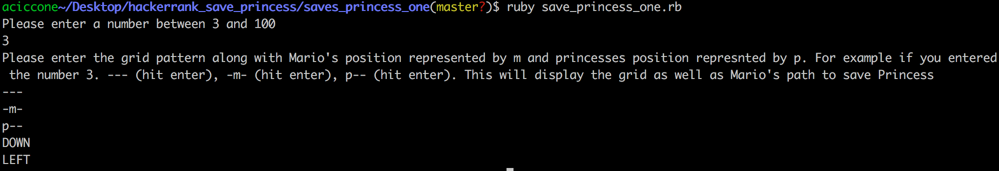
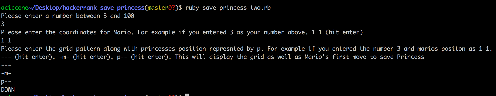

## Save the Princess Challenges

* This repo contains my solutions to Bot Saves Princess and Bot Saves Princess - 2 from HackerRank. Please see links below if you want more information on the challenges.

* [Bot saves princess link](https://www.hackerrank.com/challenges/saveprincess)

* [Bot saves princess -2  link](https://www.hackerrank.com/challenges/saveprincess2)


## Getting Started

Clone repo
```
git clone git@github.com:antciccone/hackerrank_save_princess.git
```

Navigate to folder
```
cd hackerrank_save_princess
```

Running Bot Saves Princess challenge one
```
ruby save_princess_one.rb
```
You will then be prompted to enter a grid size and grid pattern.



Running Bot Saves Princess challenge two
```
ruby save_princess_two.rb
```
You will then be prompted to enter a grid size, Mario's coordinates and the grid pattern.



## Running Tests
Run tests for Bot Saves Princess challenge one
```
rspec saves_princess_one
```

Run tests for Bot Saves Princess challenge two
```
rspec saves_princess_two
```


## Technology Used
* Ruby Version - ruby 2.3.1
* Testing - Rspec
* Debugging - Pry
